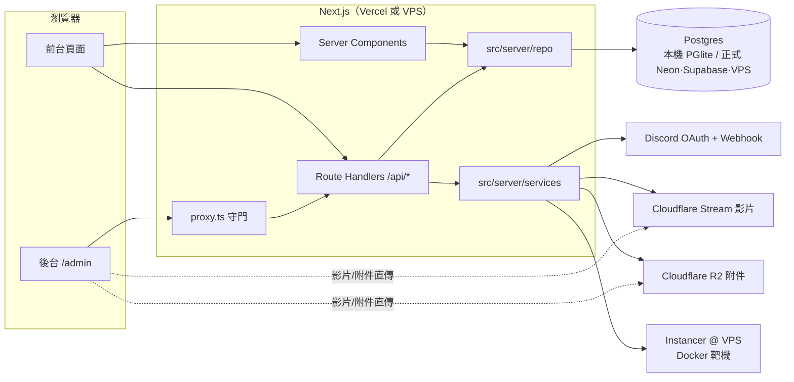

# 系統架構

SCIST Gate 是一個 Next.js 16 專案，前台、後台、API 都在同一個程式碼庫，一次部署。外部服務只有四個，而且每一個都可以先不接。

## 目錄

| 路徑 | 內容 |
| --- | --- |
| `src/app/(pages)` | 前台頁面，全部 `force-dynamic`，每次請求從資料庫讀 |
| `src/app/admin/**` | 後台：總覽、路徑、課程與影片、題庫、活動、講師、學員與角色、問答、靶機環境、數據、操作紀錄、設定 |
| `src/app/api/**` | Route Handler，合約在 [API.md](API.md) |
| `src/proxy.ts` | `/admin/*` 的伺服器端守門：沒有講師以上的 session 就導回 `/?login=admin&next=原路徑`，首頁的登入框讀到後開啟，登入完帶回原頁 |
| `src/components/**` | UI 元件；`admin/` 是後台專用；`progress-sync.tsx` 負責把 session 同步進學員端狀態 |
| `src/admin/` | 後台的資料介面 `AdminApi`（HTTP 版與本機版）與型別 |
| `src/store/progress.ts` | 學員端狀態：訪客存 localStorage；登入後每個動作鏡射到 API，並從 `/api/me` 回填 |
| `src/lib/api.ts` | 前端呼叫自家 API 的小工具 |
| `src/data/*.ts` | 型別、常數（類別、學校、贊助方案）與示範內容；示範內容只用來 seed |
| `src/server/db/` | Drizzle schema、連線、migration、seed |
| `src/server/repo/` | 所有資料庫存取；page 與 route 都只呼叫這層。`content` 課程與題目、`learner` 進度與解題、`site` 講師、排行榜、統計、動態、`community` 問答、`users`、`instructors`、`ops` 稽核、靶機、數據、`settings`、`transfer` |
| `src/server/services/` | 外部服務：Stream、R2、instancer、Discord |
| `src/server/auth.ts` | Session（JWT cookie）、帳號密碼、可選 Discord、權限守衛 |
| `src/server/validators.ts` | 所有 API 輸入的 zod schema |
| `drizzle/` | SQL migration，由 `pnpm db:generate` 產生 |
| `scripts/` | migrate / seed / reset |
| `instancer/` | 跑在 VPS 上的靶機服務 |
| `docs/` | 這些文件 |

## 資料模型

完整定義在 `src/server/db/schema.ts`，重點：

- **內容**：`tracks → modules → lessons`；`challenges` 帶 `challenge_flags`（只存 SHA-256）、`challenge_hints`、`challenge_files`；`events`；`instructors`；`schools`。
- **學員**：`users`（帳號、密碼雜湊、可選 Discord、角色）、`lesson_progress`（看到哪、檢查站、筆記）、`solves`、`attempts`（只存提交的雜湊）、`hint_unlocks`、`xp_ledger`（所有 XP 變動的流水帳，排行榜與統計由它加總）、`instances`、`event_registrations`。
- **社群**：`questions`、`answers`。
- **營運**：`settings`（key/value JSON）、`audit_log`（後台每個寫入一筆，`/admin/audit` 顯示）。

課程內容（段落、程式碼、提示框）與檢查站題目以 JSON 存在 `lessons.content` / `lessons.checkpoints`，型別與前台共用（`src/data/tracks.ts` 的 `ContentBlock`、`Checkpoint`）。

## 一個請求怎麼走

- **前台頁面**：Server Component 呼叫 repo（例如 `getTracksPublic()`），拿到跟 `src/data` 一樣形狀的物件，直接渲染。互動元件（播放器、flag 提交、問答）是 client component，透過 `/api/*` 寫入。
- **學員狀態**：`ProgressSync` 在每次載入與分頁回到前景時打 `GET /api/me`。有 session 就用回應覆蓋本機 store（伺服器為準）；沒有就當訪客。訪客第一次登入時，瀏覽器裡的檢查站、看課進度、筆記會重播到帳號。
- **後台**：client component 透過 `AdminApi.http` 打 `/api/admin/*`；`proxy.ts` 先確認 cookie 裡的角色，API 再各自 `requireRole`。

## 登入與權限

- Session 是 `jose` 簽的 JWT，放在 httpOnly cookie `scist_session`，30 天。
- 預設登入是帳號密碼（scrypt 雜湊）。註冊一律學員；庫裡還沒有管理員時，第一個註冊的人成為管理員。`ADMIN_HANDLES` / `BOOTSTRAP_ADMIN_*` 可指定管理員。
- 角色四級：`student < ta < instructor < admin`。`requireRole("instructor")` 之類的守衛在每支 API 裡。角色只能由管理員改，不能在登入時自選。
- 角色以資料庫為準（cookie 只是快取；`GET /api/me` 會重簽），停權的帳號立即失效。
- `ENABLE_DEV_LOGIN=1` 才開 `POST/GET /api/auth/dev` 與 `/admin?as=…`。正式站永遠關。

## 資料庫

- 沒設 `DATABASE_URL` → PGlite（內嵌 Postgres，存在 `.data/pglite`）。`pnpm dev` 零設定。
- 設了 `DATABASE_URL` → `postgres-js` 連正式 Postgres。
- migration 在第一次連線時自動套用；CI 也可以跑 `pnpm db:migrate`。
- 空資料庫在開發環境自動灌示範內容；正式環境設 `AUTO_SEED=1` 才會。
- schema 改了就 `pnpm db:generate` 產生新的 migration 檔並一起 commit。

## 後台的兩種模式

| | HTTP 模式（預設） | 本機模式 |
| --- | --- | --- |
| 開關 | 不設定 | `NEXT_PUBLIC_ADMIN_API=local` |
| 資料在哪 | 資料庫 | 瀏覽器 localStorage |
| 前台會變嗎 | 會 | 不會 |
| 需要登入嗎 | 要（講師以上） | 不用（只適合看畫面，不要當正式後台） |
| 適合 | 真正上架內容 | 看畫面、demo、UX 討論 |

## 部署拓樸（建議）

| 元件 | 放哪 | 費用 |
| --- | --- | --- |
| Next.js | Vercel（Hobby 免費起） | 0 |
| Postgres | Neon 免費層或 Supabase 免費層 | 0 |
| 影片 | Cloudflare Stream | 每千分鐘儲存 5 美元、每千分鐘播放 1 美元 |
| 附件 | Cloudflare R2 | 10 GB 內免費，流量免費 |
| 靶機 | 企劃書的 Cloud VPS + Docker + instancer | VPS 費用 |
| 登入 | 帳號密碼（可選 Discord） | 0 |
| 通知 | Discord Webhook | 0 |

這樣年維運落在企劃書估的 2 到 3 萬內。
